# VsAiCompanion Repository Analysis

*Comprehensive analysis from Software Architect, Developer, and Product Manager perspectives*

---

## Executive Summary

The **Jocys.com VS AI Companion** is a sophisticated AI-powered development assistant that bridges the gap between developers and AI services. It operates as both a Visual Studio extension and standalone application, providing comprehensive AI assistance for code analysis, debugging, documentation, and productivity enhancement.

**Key Value Propositions:**
- Multi-AI service integration (OpenAI, Azure, Google Gemini, xAI Grok)
- Template-driven task automation
- Custom fine-tuning capabilities
- Enterprise-grade security and privacy
- Extensible plugin architecture

---

## 🏗️ Software Architect Perspective

### System Architecture Overview

```mermaid
graph TB
    subgraph "User Interface Layer"
        VSExt[Visual Studio Extension]
        StandaloneApp[Standalone WPF App]
        WebUI[Web Interface]
    end
    
    subgraph "Core Engine Layer"
        Engine[AI Companion Engine<br/>Multi-Target: .NET 4.8 / .NET 8.0]
        MainControl[Main Control<br/>WPF UserControl]
        ChatSystem[Chat Control System]
        TemplateEngine[Template Engine]
    end
    
    subgraph "AI Services Layer"
        AIFactory[AI Client Factory]
        OpenAIClient[OpenAI Client]
        AzureClient[Azure OpenAI Client]
        GeminiClient[Google Gemini Client]
        GrokClient[xAI Grok Client]
    end
    
    subgraph "Plugin System"
        PluginCore[Plugin Core]
        LinkReader[Link Reader Plugin]
        TeamsPlugin[Teams Plugin]
        CustomPlugins[Custom Plugins...]
    end
    
    subgraph "Data & Storage"
        DataClient[Data Client]
        SqlFunctions[SQL Functions]
        EmbeddingsDB[Embeddings Database]
        SettingsStore[Settings Storage]
    end
    
    subgraph "Security & Auth"
        TokenHandler[Token Handler]
        VaultManager[Azure Key Vault]
        DomainHelper[Domain Authentication]
        MSGraphAuth[Microsoft Graph Auth]
    end
    
    VSExt --> Engine
    StandaloneApp --> Engine
    WebUI --> Engine
    
    Engine --> AIFactory
    Engine --> ChatSystem
    Engine --> TemplateEngine
    Engine --> PluginCore
    
    AIFactory --> OpenAIClient
    AIFactory --> AzureClient
    AIFactory --> GeminiClient
    AIFactory --> GrokClient
    
    PluginCore --> LinkReader
    PluginCore --> TeamsPlugin
    PluginCore --> CustomPlugins
    
    Engine --> DataClient
    DataClient --> SqlFunctions
    DataClient --> EmbeddingsDB
    Engine --> SettingsStore
    
    Engine --> TokenHandler
    TokenHandler --> VaultManager
    TokenHandler --> DomainHelper
    TokenHandler --> MSGraphAuth
    
    style Engine fill:#e1f5fe
    style AIFactory fill:#f3e5f5
    style PluginCore fill:#e8f5e8
    style DataClient fill:#fff3e0
```

### Component Architecture Details

#### 1. **Multi-Target Framework Strategy**
- **Primary Targets**: .NET Framework 4.8 (VS Extension compatibility) and .NET 8.0 (Modern features)
- **Platform**: Windows-specific with WPF/WinForms UI
- **Architecture**: x64 primary target with AnyCPU compatibility

#### 2. **Modular Design Principles**

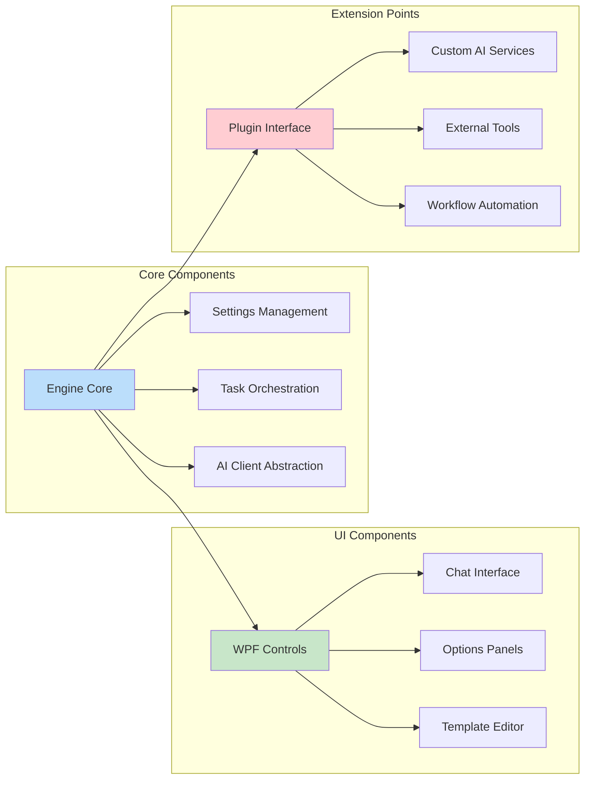

#### 3. **AI Service Abstraction Layer**

The architecture implements a sophisticated abstraction pattern for AI services:

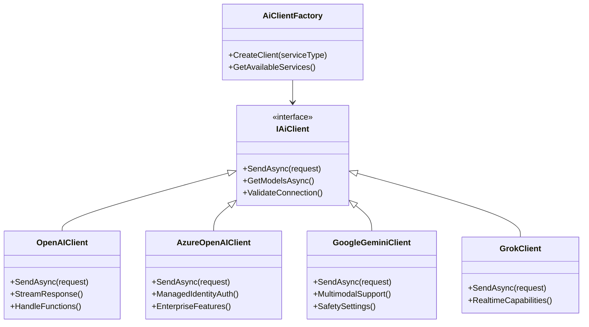

### Deployment Architecture

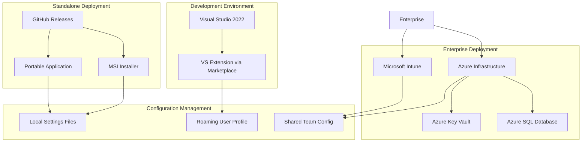

### Security Architecture

**Multi-Layered Security Design:**

1. **Authentication Layer**: Azure AD, Microsoft Graph, Domain Authentication
2. **Secret Management**: Azure Key Vault integration for API keys
3. **Data Protection**: Local encryption for sensitive settings
4. **Code Security**: Comprehensive security scanning (SonarCloud, CodeQL, Dependabot)
5. **Network Security**: TLS/SSL for all API communications

---

## 👨‍💻 Software Developer Perspective

### Codebase Analysis

**Quantitative Overview:**
- **Total Projects**: 15+ projects in solution
- **Core Classes**: 253+ identified classes in Engine alone
- **Supported Frameworks**: .NET 4.8, .NET 8.0-windows
- **UI Technology**: WPF (Windows Presentation Foundation)
- **Primary Language**: C# with PowerShell automation scripts

### Key Development Patterns

#### 1. **Template-Driven Development**

The application uses a sophisticated template system for AI interactions:

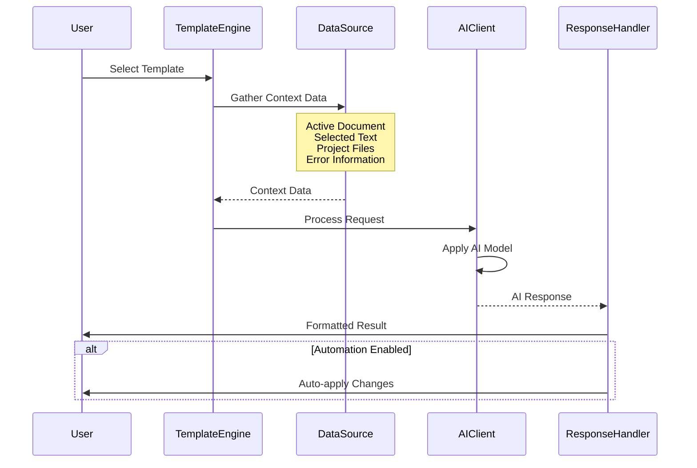

#### 2. **Plugin Architecture Pattern**

```csharp
// Simplified plugin interface structure
public interface IPlugin
{
    string Name { get; }
    string Description { get; }
    Task<PluginResult> ExecuteAsync(PluginContext context);
    bool CanExecute(PluginContext context);
}

public class PluginsManager
{
    public async Task<List<PluginItem>> LoadPluginsAsync(string path)
    {
        // Dynamic assembly loading
        // API discovery via reflection
        // Security validation
    }
}
```

#### 3. **MVVM Implementation**

Extensive use of MVVM pattern with `NotifyPropertyChanged` base class:

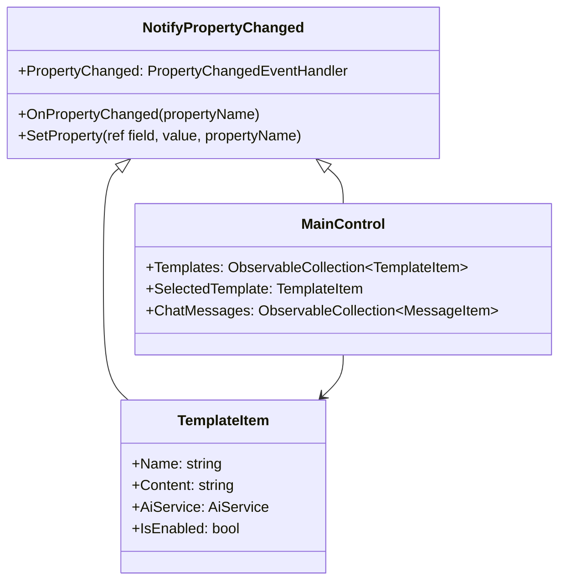

### Core Features Implementation

#### 1. **Multi-AI Service Support**

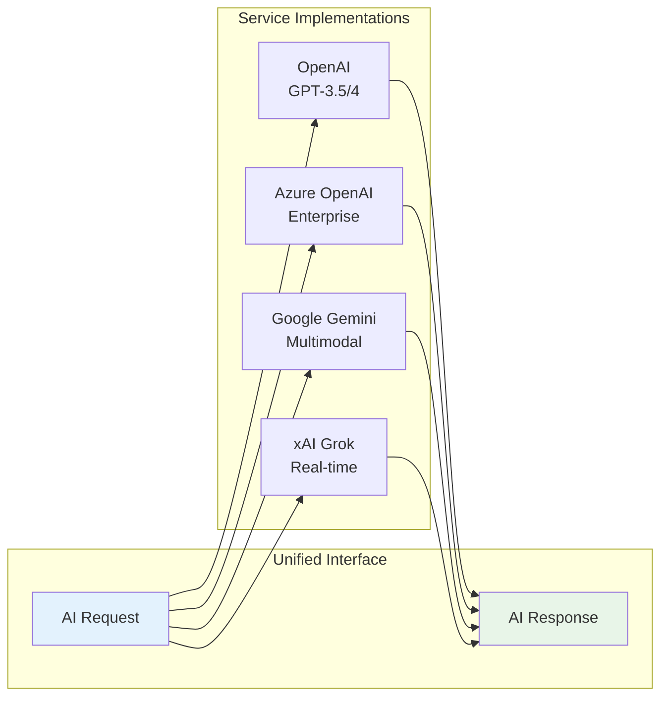

#### 2. **Visual Studio Integration**

Key integration points:
- **Error List Integration**: Direct error fixing assistance
- **Active Document Context**: Real-time code analysis
- **Solution Explorer**: Project-wide operations
- **Debug Context**: Exception analysis and fixing

#### 3. **Advanced Features**

**AI Avatar System:**
- Speech synthesis with mouth animation
- Real-time voice interaction
- Customizable avatar appearance

**Fine-Tuning Support:**
- Custom model creation
- Training data management
- Model deployment automation

**Embeddings System:**
- Document similarity search
- Context-aware responses
- Knowledge base integration

### Development Workflow

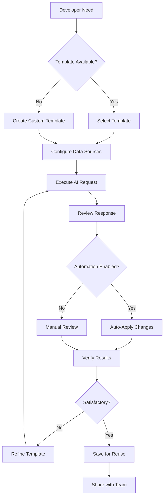

### Code Quality Measures

**Implemented Quality Assurance:**
- **Static Analysis**: SonarCloud integration
- **Security Scanning**: Multiple tools (CodeQL, Bandit, BinSkim)
- **Dependency Management**: Dependabot monitoring
- **Secret Detection**: Automated secret scanning
- **Code Coverage**: Comprehensive testing strategies

---

## 📊 Product Manager Perspective

### Market Position & Competitive Analysis

#### Current Landscape

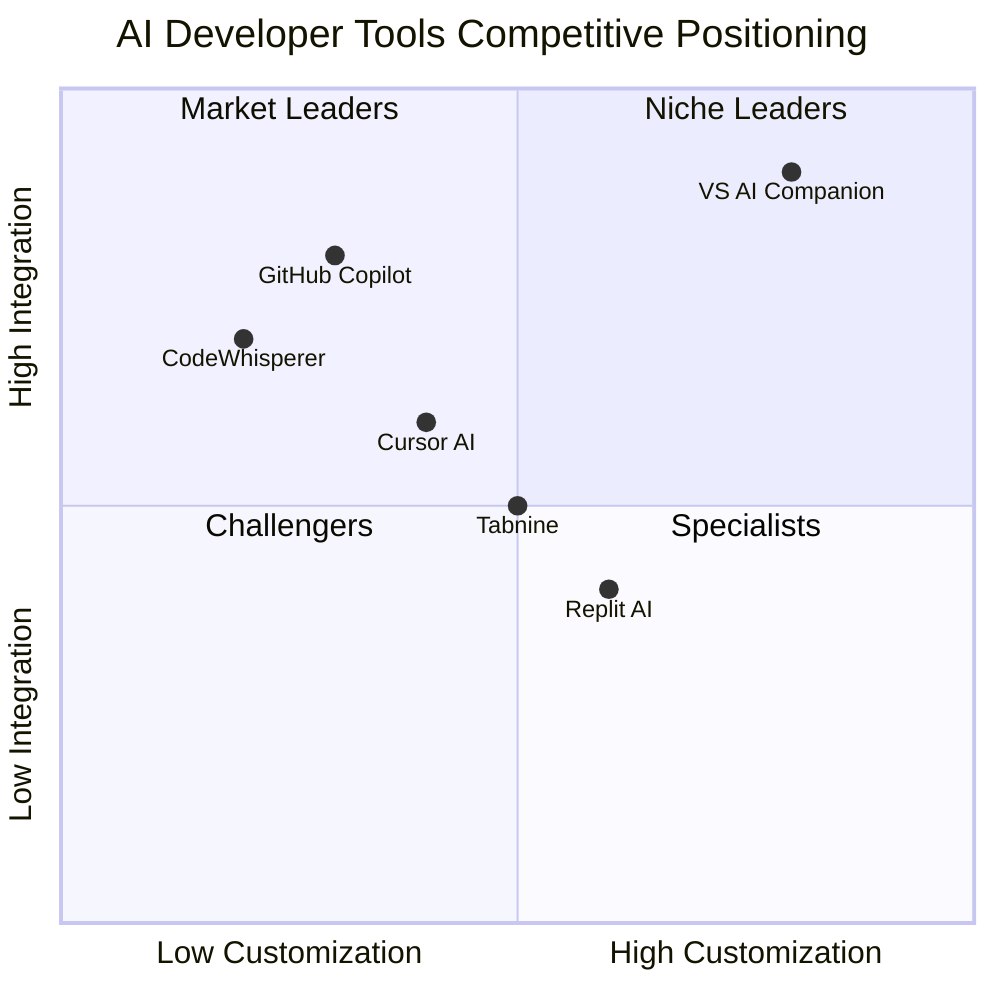

#### Unique Value Propositions

1. **Multi-Service AI Integration**: Unlike competitors focused on single AI providers
2. **Template-Driven Approach**: Reusable, shareable AI interaction patterns
3. **Enterprise Privacy**: On-premises deployment options with Azure integration
4. **Visual Studio Deep Integration**: Native VS extension with full IDE context
5. **Custom Fine-Tuning**: Ability to create domain-specific AI models

### Target User Personas

#### Primary Personas

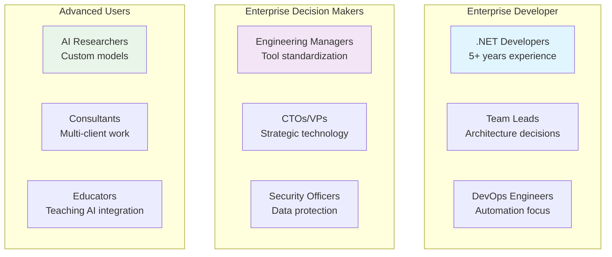

#### User Journey Mapping

**New User Onboarding:**
1. **Discovery**: GitHub/VS Marketplace
2. **Installation**: One-click VS extension or portable app
3. **Configuration**: API key setup with guided wizard
4. **First Success**: Pre-built templates for common tasks
5. **Adoption**: Custom template creation
6. **Advocacy**: Team sharing and collaboration

### Feature Roadmap Analysis

Based on `TODO.md` analysis, future development priorities:

```mermaid
timeline
    title Product Roadmap (Based on TODO Analysis)
    
    section Immediate (Q1-Q2)
        : UI Language Support
        : File Attachment Support
        : Template Update Automation
        
    section Short-term (Q3-Q4)
        : Application Localization
        : Enhanced Visual Studio Macros
        : Advanced Tooltip AI Monitoring
        
    section Medium-term (Year 2)
        : Windows Automation Integration
        : Perpetual Learning Cycles
        : Secondary AI Validation
        
    section Long-term (Year 3+)
        : Full Code Generation & Execution
        : Advanced Plugin MIME Support
        : Autonomous Development Assistance
```

### Business Model & Revenue Opportunities

#### Current Model: Open Source + Service Dependencies

**Strengths:**
- Low barrier to entry
- Community contributions
- Enterprise trust through transparency

**Revenue Opportunities:**
1. **Enterprise Support**: Professional services and support contracts
2. **Cloud Hosting**: Managed AI service with enterprise features
3. **Custom Integrations**: Bespoke enterprise implementations
4. **Training & Certification**: Professional development programs

### Market Metrics & KPIs

#### Adoption Metrics
- **Downloads**: GitHub releases tracking
- **VS Marketplace**: Installation and rating metrics
- **Community**: Issues, pull requests, discussions

#### Engagement Metrics
- **Daily Active Users**: Template execution frequency
- **Feature Utilization**: Most used AI services and templates
- **Retention**: Continued usage over time

#### Quality Metrics
- **Response Accuracy**: AI response quality tracking
- **Performance**: Response time and reliability
- **Security**: Vulnerability response time

### Competitive Advantages

#### Technical Differentiators

1. **Architectural Flexibility**
   - Multi-framework support (.NET 4.8 + .NET 8.0)
   - Plugin-extensible architecture
   - Service-agnostic AI integration

2. **Enterprise-Grade Security**
   - Azure Key Vault integration
   - Comprehensive security scanning
   - On-premises deployment options

3. **Developer Experience**
   - Native Visual Studio integration
   - Template-driven workflows
   - Extensive customization options

#### Strategic Advantages

1. **Open Source Transparency**: Build trust through code visibility
2. **Vendor Neutrality**: Not tied to single AI provider
3. **Privacy Focus**: Data retention control and local processing options
4. **Community Ecosystem**: Extensible through plugins and templates

### Risk Analysis

#### Technical Risks
- **AI Service Dependencies**: API changes and pricing
- **Platform Lock-in**: Windows/Visual Studio dependency
- **Performance Scaling**: Large project handling

#### Business Risks
- **Competition**: Major players (Microsoft, Google) expanding offerings
- **Regulatory**: AI governance and compliance requirements
- **Market Saturation**: Developer tool market maturity

#### Mitigation Strategies
- **Diversification**: Multiple AI service support
- **Standards Compliance**: Industry best practices adoption
- **Community Building**: User-driven development priorities

---

## 🔧 Technical Deep Dives

### Plugin System Architecture

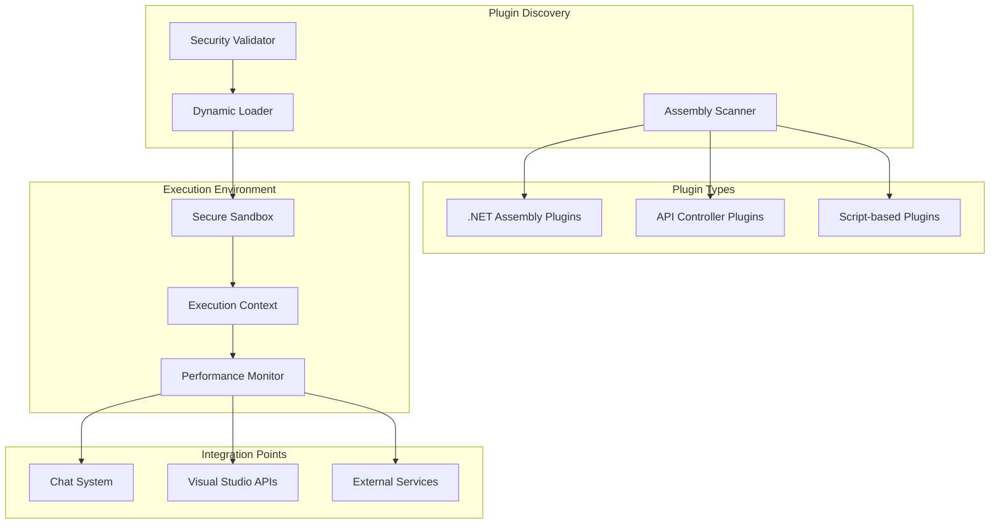

### AI Service Integration Flow

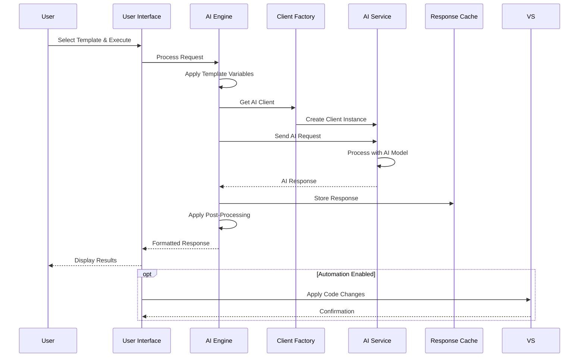

### Security Implementation

The application implements defense-in-depth security:

1. **Authentication Layer**
   - Azure AD integration
   - Microsoft Graph API access
   - Domain-based authentication

2. **Secret Management**
   - Azure Key Vault for API keys
   - Local encryption for sensitive data
   - Secure token handling

3. **Code Security**
   - Static analysis (SonarCloud, CodeQL)
   - Dependency scanning (Dependabot)
   - Secret detection automation

4. **Runtime Security**
   - Plugin sandboxing
   - API request validation
   - Secure inter-process communication

---

## 📈 Performance & Scalability

### Performance Characteristics

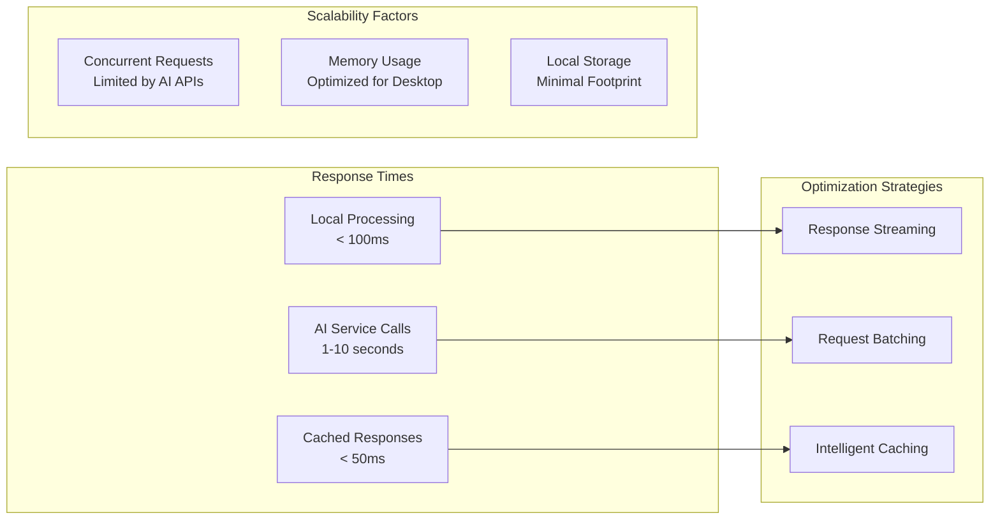

### Resource Management

- **Memory**: Efficient object lifecycle management
- **Network**: Intelligent request batching and retry logic
- **Storage**: Minimal local footprint with cloud sync options
- **CPU**: Asynchronous processing for UI responsiveness

---

## 🔮 Future Considerations

### Technology Evolution

1. **AI Advancement**: Integration with emerging AI models and capabilities
2. **Platform Expansion**: Potential VS Code, JetBrains IDE support
3. **Cloud Integration**: Enhanced Azure/cloud-native features
4. **Mobile/Web**: Cross-platform accessibility

### Architectural Evolution

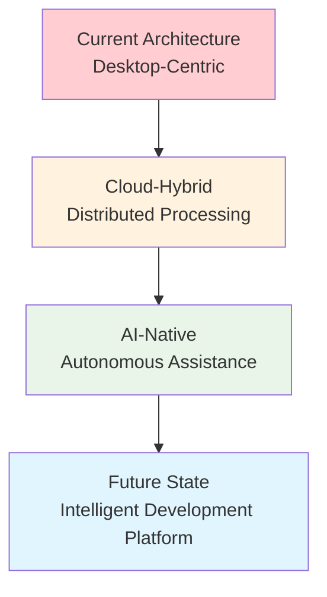

### Innovation Opportunities

1. **Advanced Automation**: Self-improving development workflows
2. **Team Intelligence**: Collaborative AI assistance
3. **Predictive Development**: Proactive issue identification
4. **Knowledge Systems**: Institutional knowledge preservation

---

## 📋 Conclusions & Recommendations

### Strengths

1. **Architectural Excellence**: Well-designed, extensible architecture
2. **Developer Focus**: Deep understanding of developer needs
3. **Technology Integration**: Sophisticated multi-AI service support
4. **Security Posture**: Enterprise-grade security implementation

### Areas for Enhancement

1. **Platform Expansion**: Consider cross-platform development
2. **User Experience**: Streamline onboarding and setup
3. **Performance**: Optimize for large-scale enterprise deployments
4. **Documentation**: Expand developer and user documentation

### Strategic Recommendations

#### For Development Team
1. **Prioritize Cross-Platform**: Consider .NET MAUI for broader reach
2. **Enhance Plugin Ecosystem**: Developer toolkit for plugin creation
3. **Performance Optimization**: Focus on large project handling
4. **API Standardization**: Create standardized plugin interfaces

#### For Product Strategy
1. **Enterprise Focus**: Target enterprise development teams
2. **Community Building**: Foster active developer community
3. **Integration Partnerships**: Partner with major development tool vendors
4. **Thought Leadership**: Position as AI development best practices leader

#### For Technology Evolution
1. **Cloud-Native Features**: Enhanced Azure integration
2. **AI Model Management**: Streamlined custom model workflows
3. **Collaborative Features**: Team-based template sharing
4. **Analytics Integration**: Usage analytics and optimization insights

---

*This analysis represents a comprehensive evaluation of the VsAiCompanion repository as of January 2025, based on codebase analysis, documentation review, and industry context.*
