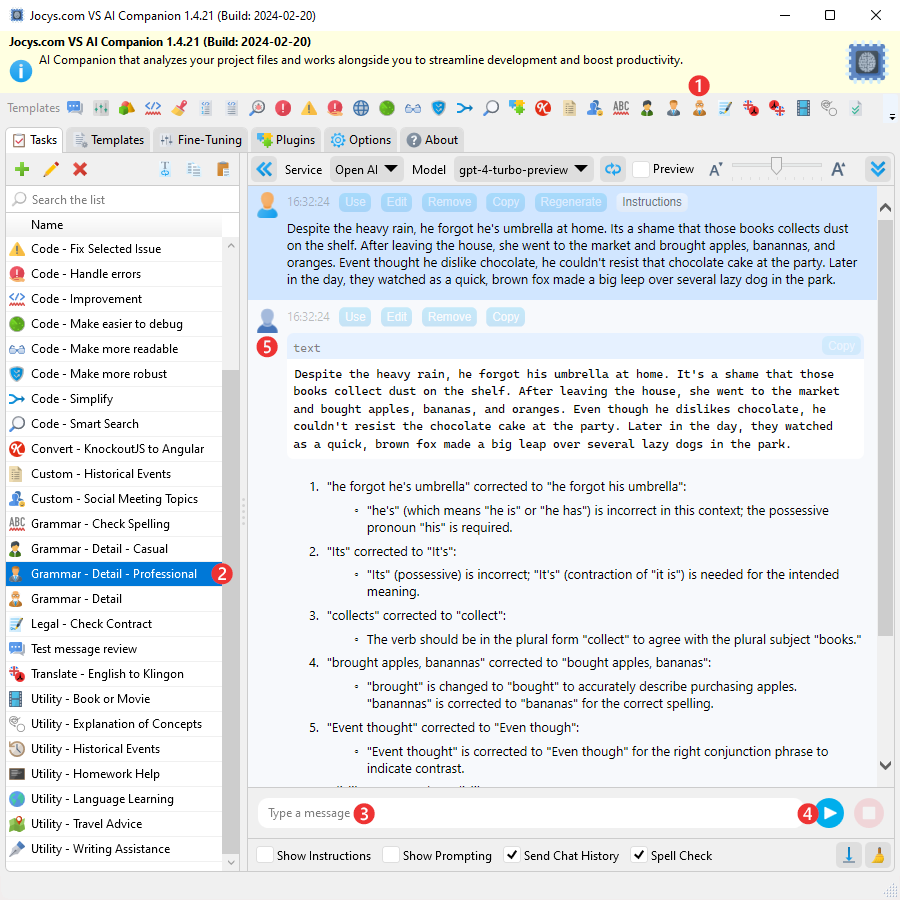

# How To

## How to check spelling and grammar

1. Click on the "Grammar - Detail - Professional" template icon on the toolbar.
2. Select a task that has been cloned from the "Grammar - Detail - Professional" template.
3. Enter the text you would like to check.
4. Click the [Send] button.
5. Wait for the response from the AI to appear in the chat.

## How to Fix Selecetd Error in Visual Studio

1. Double-click on the error you would like to fix in the "Error List" panel.
2. Wait for the file with the error to open. It will become the active document.
3. Optional: Click on the "Code - Fix Selected Error" template icon on the toolbar.
4. Choose a task that has been cloned from the "Code - Fix Selected Error" template.
5. Select the "Active Document" as the attachment to send.
6. Check the "Selected Error" as the attachment to send.
7. Select "Replace" under Automation (VS) if you are brave enough to rely on AI for the correct solution. 
8. Click the [Send] button.
9. Wait for the AI's response to appear in the chat. Active document will be fixed by AI.

