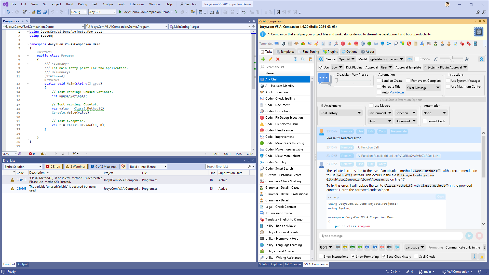
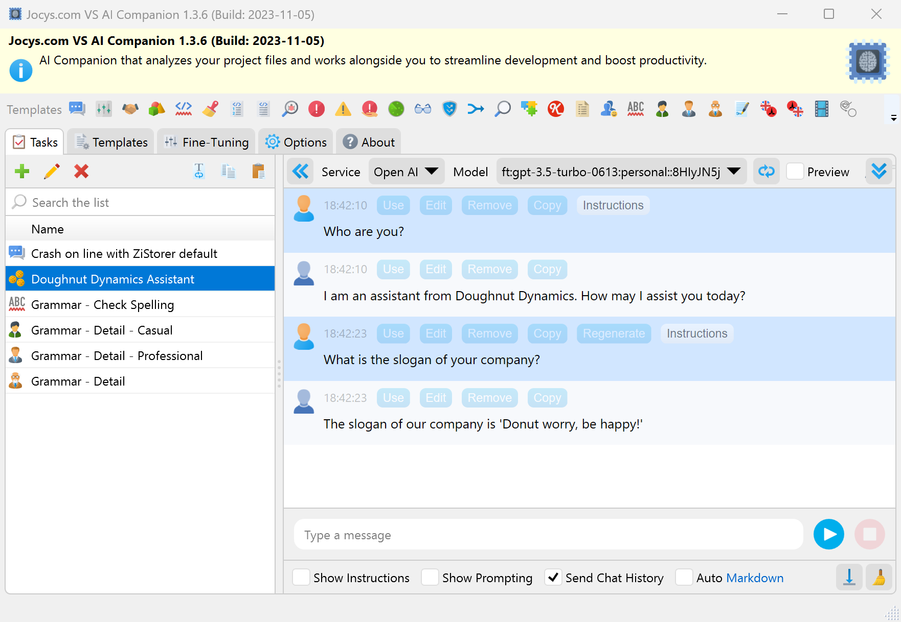

# Jocys.com VS AI Companion
This is a free and open-source project for people who have an [OpenAI API](https://platform.openai.com/) (GPT-3/4, Davinci...) subscription, also run Open AI on their local machine ([GPT4All](https://gpt4all.io/)), as well as those who run AI on-premises or on Azure Cloud.

The AI Companion is a tool that analyzes your project files and works alongside you to streamline development and boost productivity. It can be installed as a Visual Studio extension or run as a standalone application. It's like a Swiss Army Knife of AI for developers. Application allows you to easily create custom, fine-tuned AI models for company chatbots or virtual employees.

### Why Use Tools Utilizing API Instead of Web Chat GPT?

- Data submitted via the API is not used to train or improve its models, unless customers explicitly decide to share their data.
- Web Chat is limited to 4K tokens, while AI models on API can process data 4-8 times larger.
- API provides access to more recent and smarter AI models.

### Download
Digitally Signed Standalone/Portable Application v1.4.6 (2024-02-14)

[Download - JocysCom.VS.AiCompanion.App.zip](https://github.com/JocysCom/VsAiCompanion/releases/download/1.4.6/JocysCom.VS.AiCompanion.App.zip)

Install Visual Studio Extension from <a href="https://marketplace.visualstudio.com/items?itemName=JocysCom.JocysComVsAiCompanion">VS AI Companion - Visual Studio Marketplace</a> or install by using Visual Studio Extension Manager.

### How can I access GPT-4?
https://help.openai.com/en/articles/7102672-how-can-i-access-gpt-4

### System Requirements
- Microsoft .NET 6.0
  https://dotnet.microsoft.com/download/dotnet

### Why was this extension created?
Existing tools like GitHub CoPilot have limitations when it comes to interacting with AI. I wanted to create an app that could handle common tasks with more in-depth AI guidance and information. This tool does not replace GitHub CoPilot, but rather offers new features. My goal was to create a tool that would assist AI in responding to inquiries about an entire project or in revamping a Visual Studio solution using a different framework. Right now, you have the ability to request a project rewrite, as the extension can send an entire project or solution. However, there are some necessary updates that need to be made in order to save the outcomes.

### Limitations
You can ask questions about an entire solution or project using the "Code - Smart Search" template. However, the size of the solution or project is limited by the maximum amount of tokens the AI can process. People who have access to the GPT-4 API can upload projects or solutions for AI analysis, up to sizes of 96KB (about 3 bytes per token). These limitations could potentially be removed if AI is hosted on-premises.

### How it works
This application (or extension) allows you to create advanced prompt templates and include data from various sources such as the Clipboard, Selection, Active Document, Selected Documents, Active Project, Selected Project, Solution, Selected Error, Exception with relevant code files, or Chat History. You can execute this template with just one button press, and the data will be sent to your preferred AI model for results at https://api.openai.com.

### Data Safety Concerns
OpenAI will not use the data submitted by customers via the OpenAI API to train or improve its models, unless customers explicitly decide to share their data for this purpose. Customers have the option to opt-in to share data. Please note that this data policy does not apply to OpenAI's Non-API consumer services like ChatGPT or DALL·E. More information can be found at: https://openai.com/policies/api-data-usage-policies."

### Where to get API Organization ID and API Key?
https://platform.openai.com/account/org-settings

### How-To Examples
How-To examples can be found here: [HOWTO.md](HOWTO.md)

## Screenshots
Visual Studio Extension: Open the extension in Visual Studio:

Standalone Application: Quickly access tasks from the notification icon in the tray:

Code - Smart Search: The AI can help you find the specific location of code features in the project or solution.

Select Errors or Warnings reported by Visual Studio and ask AI to fix it:

Ask AI to fix the exception by either copying and pasting the exception info as a message or clicking the [Send] button when Visual Studio throws it during debugging:

Application Options:

Task and template settings are saved in separate files for easy exchange and sharing:

Various Templates:

Template: Code - Document

Template: Custom - Historical Events

Template: Translate - English to Klingon:

Fine-Tuning: Create Custom Model

Fine-Tuning: Create Assistant (Virtual Employee)

Plugins: Allow AI to run applications and scripts on your machine.

Plugins: Ask AI about solution, changed files or the code.

