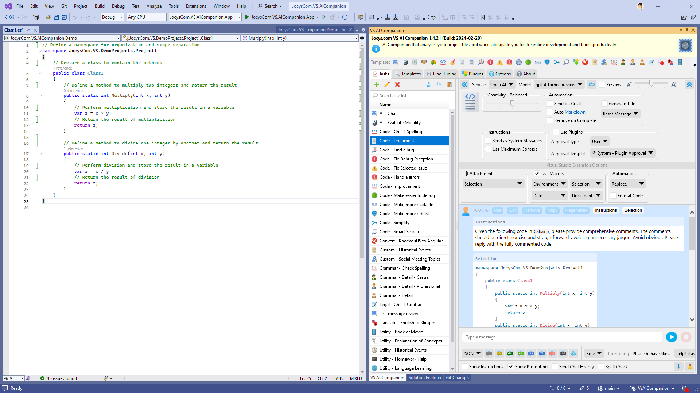
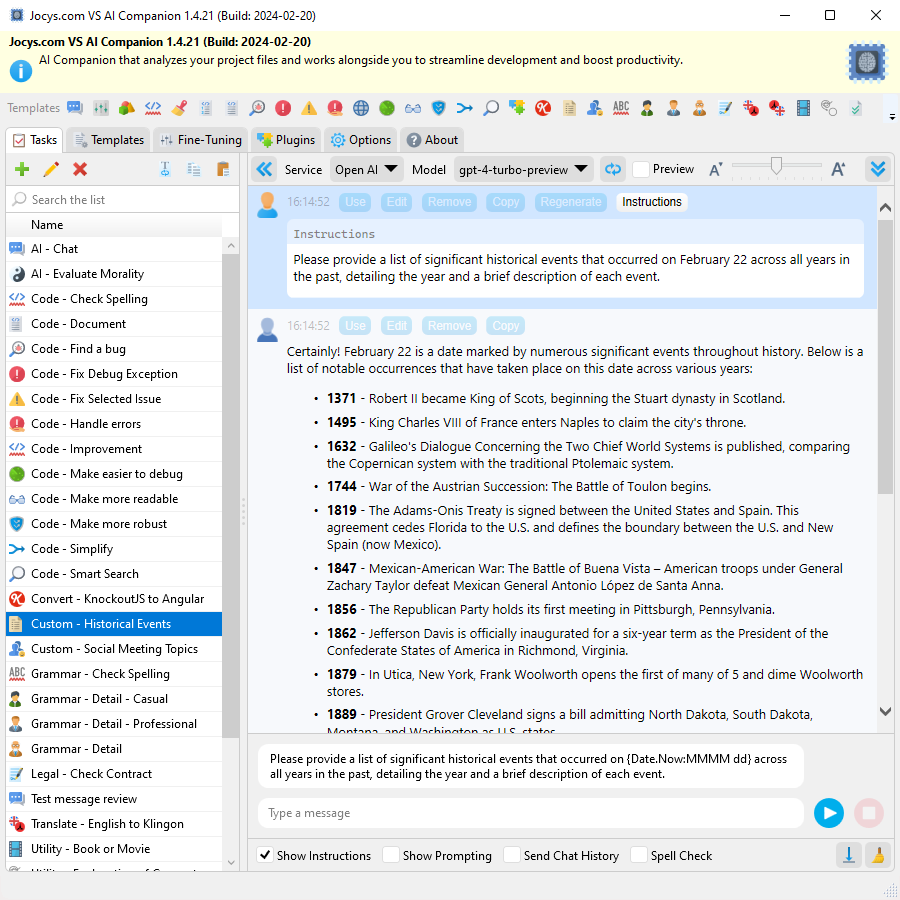
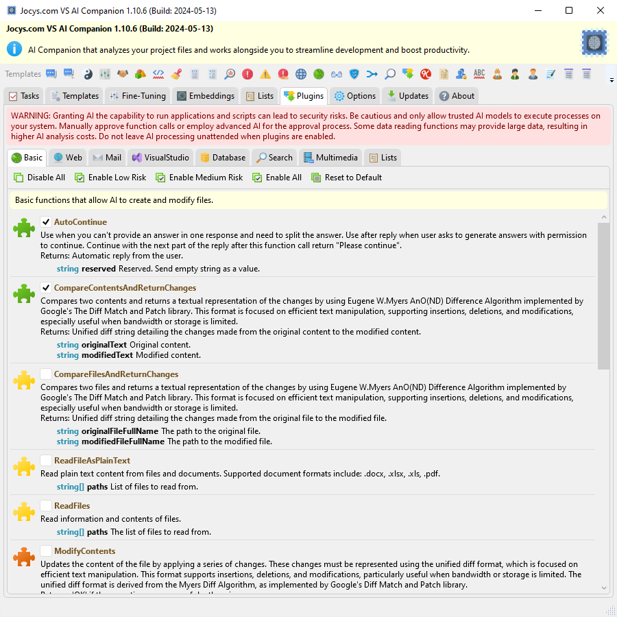

# Jocys.com VS AI Companion

<table>
  <tr>
    <td width="200"></td>
    <td>AI Companion is a tool that answers questions, analyzes project files, and enhances productivity. It simplifies the creation of custom, fine-tuned AI models that can function as chatbots or virtual employees. AI Companion can run as a standalone portable application or as a Visual Studio extension. Extension version can also be installed and updated via Visual Studio Extension Manager. It's a free, open-source project for people with an <a href="https://platform.openai.com">OpenAI API</a> (GPT-3/4, Davinci) subscription or those running OpenAI on their local machine (<a href="https://gpt4all.io">GPT4All</a>), on-premises, or on Azure Cloud.</td>
  </tr>
</table>

### Why Use Tools Utilizing API Instead of Web Chat GPT?

- Data submitted via the API isn't used for model training unless users choose to share it.
- API provides access to more recent and smarter AI models.
- Extensive customization and configuration.

### DOWNLOAD -  v1.12.76 (2024-08-28)  

[JocysCom.VS.AiCompanion.App.zip](https://github.com/JocysCom/VsAiCompanion/releases/download/1.12.76/JocysCom.VS.AiCompanion.App.zip) - digitally signed standalone/portable application.

[AI Companion as Visual Studio Extension on Visual Studio Marketplace](https://marketplace.visualstudio.com/items?itemName=JocysCom.JocysComVsAiCompanion) - install via Visual Studio Extension Manager.

### Requirements

[Microsoft .NET 8.0](https://dotnet.microsoft.com/download/dotnet) (included in Windows 11 by default) for app to work on Windows 8/10.

[OpenAI account (API Key)](https://platform.openai.com/account/) for ChatGPT models to work in AI Companion app:  
AI Companion app ► Options ► AI Services ► Open AI ► enter API Key.

[OpenAI account (Usage Tier 1)](https://platform.openai.com/docs/guides/rate-limits/usage-tiers?context=tier-one) to access GPT-4 models.

[Microsoft Azure account (API Key)](https://github.com/JocysCom/VsAiCompanion/wiki/Feature-%E2%80%90-AI-Avatar) for ChatGPT to answer with voice and mouth animation:  
AI Companion app ► Options ► AI Services ► Speech Service ► enter API Key.  
AI Companion app ► Tasks ► Main ► Instructions ► [unchecked] Use System Messages.

**For AI Companion Visual Studio extension version only:** Visual Studio 2022 17.9+  
App extension version can be installed and updated via Visual Studio Extension Manager.

### Why was this extension created?
Existing tools like GitHub CoPilot have limitations when it comes to interacting with AI. I wanted to create an app that could handle common tasks with more in-depth AI guidance and information. This tool does not replace GitHub CoPilot, but rather offers new features. My goal was to create a tool that would assist AI in responding to inquiries about an entire project or in revamping a Visual Studio solution using a different framework. Right now, you have the ability to request a project rewrite, as the extension can send an entire project or solution. However, there are some necessary updates that need to be made in order to save the outcomes.

### Limitations
[Token Limits](help.openai.com/en/articles/4936856-what-are-tokens-and-how-to-count-them) - depending on the [model](platform.openai.com/docs/models) used, requests can use up to 128,000 tokens shared between prompt and completion. Some models can have different limits on input and output. 
You can ask questions about an entire solution or project using the "Code - Smart Search" template. However, the size of the solution or project is limited by the maximum amount of tokens the AI can process. People who have access to the GPT-4 API can upload projects or solutions for AI analysis, up to sizes of 384KB (128K tokens, about 3 bytes per token). These limitations could potentially be removed if AI is hosted on-premises.

[Rate Limits](platform.openai.com/docs/guides/rate-limits) - restrictions that OpenAI API imposes on the number of times a user or client can access its services within a specified period of time.

### How it works
This application (or extension) allows you to create advanced prompt templates and include data from various sources such as the Clipboard, Selection, Active Document, Selected Documents, Active Project, Selected Project, Solution, Selected Error, Exception with relevant code files, or Chat History. You can execute this template with just one button press, and the data will be sent to your preferred AI model for results at [api.openai.com](https://api.openai.com).

### Data Safety Concerns
OpenAI will not use the data submitted by customers via the OpenAI API to train or improve its models, unless customers explicitly decide to share their data for this purpose. Customers have the option to opt-in to share data. Please note that this data policy does not apply to OpenAI's Non-API consumer services like ChatGPT or DALL·E. More information can be found at [openai.com/policies/api-data-usage-policies](https://openai.com/policies/api-data-usage-policies).

### Code Security Assurance

To ensure our codebase is secure and free from unresolved issues, we utilize a comprehensive suite of security [scan tools](https://github.com/JocysCom/VsAiCompanion/security). `Dependabot` detects vulnerabilities in dependencies. `Code Scanning` identifies common vulnerabilities and coding errors with tools such as PyCQA Bandit, Microsoft BinSkim, GitHub CodeQL, ESLint, SonarSource SonarCloud, Microsoft Antimalware, Bridgecrew Checkov, Azure TemplateAnalyzer, and Accurics Terrascan. Additionally, `Secret Scanning` detects any secrets accidentally pushed to the repository.
### Licensing

The source code is licensed under MPL-2.0 (Mozilla Public License 2.0), permitting corporations to integrate and enhance this application with proprietary code, without the requirement to disclose their modifications. Specifically, this license facilitates the use of the application for purposes such as enabling AI to access corporate resources or to automate task creation for AI, while still keeping any proprietary additions private.

This tool acts as an intermediary, facilitating data exchange between the user and the AI. Consequently, the licensing of this tool itself does not directly impact the rights to the code or content generated by the AI. Instead, the generated content is subject to the license of the AI model used (e.g., GPT-3/4, Davinci). Typically, the initiator of the AI-generated code process is granted copyright. Both OpenAI and Microsoft offer a legal safeguard, known as a "Copyright Commitment," to protect customers who face lawsuits for copyright infringement related to content generated by the companies' AI systems.

### Wiki
- [Home - Rethinking AI Integration](https://github.com/JocysCom/VsAiCompanion/wiki)
- [AI mastering tips](https://github.com/JocysCom/VsAiCompanion/wiki/Tips)
- [How-To examples](https://github.com/JocysCom/VsAiCompanion/blob/main/HOWTO.md)

## Screenshots
Visual Studio Extension: Open the extension in Visual Studio:


Standalone Application: Quickly access tasks from the notification icon in the tray:


Code - Smart Search: The AI can help you find the specific location of code features in the project or solution.


Select Errors or Warnings reported by Visual Studio and ask AI to fix it:


Ask AI to fix the exception by either copying and pasting the exception info as a message or clicking the [Send] button when Visual Studio throws it during debugging:


Application Options:


Task and template settings are saved in separate files for easy exchange and sharing:  
```C:\Users\<UserName>\AppData\Roaming\Jocys.com\VS AI Companion\```


Tasks:


Various Templates:


AI Avatar:


Template: Code - Document



Template: Custom - Historical Events



Template: Translate - English to Klingon:


Fine-Tuning: Create Custom Model


Fine-Tuning: Create Assistant (Virtual Employee)


Plugins: Allow AI to run applications and scripts on your machine.



Plugins: Ask AI about solution, changed files or the code.


