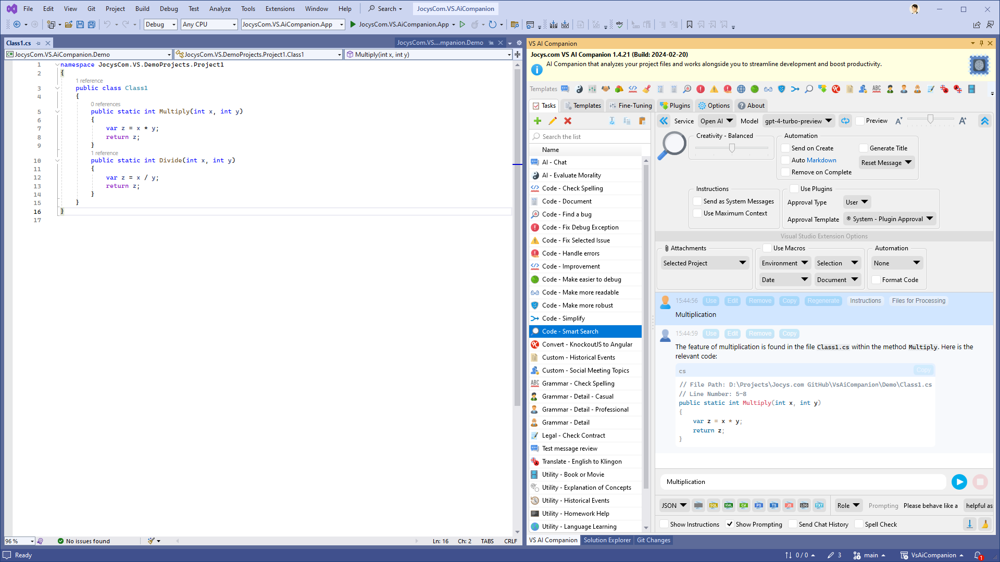
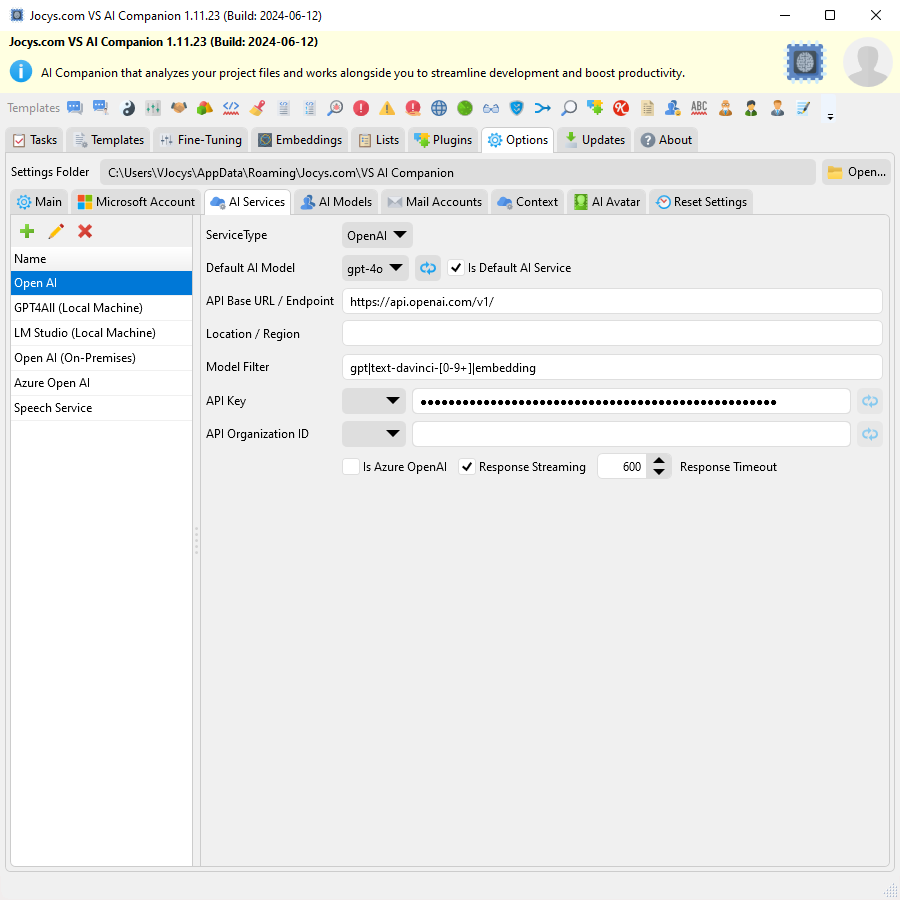
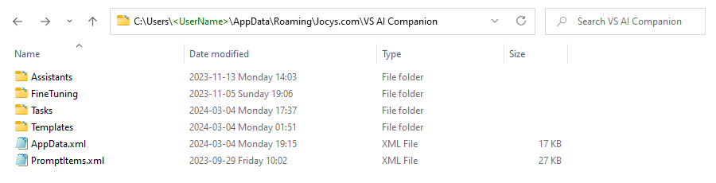

# Jocys.com VS AI Companion

The AI Companion is a tool that analyzes your project files and works alongside you to streamline development and boost productivity. It can be installed as a Visual Studio extension or run as a standalone application. It's like a Swiss Army Knife of AI for developers.

This is a free and open-source project for people who have an [OpenAI API](https://platform.openai.com/) subscription.

# Download

Digitally Signed Standalone/Portable Application v1.0.21 (2023-06-18)

[Download - JocysCom.VS.AiCompanion.App.zip](https://github.com/JocysCom/VsAiCompanion/releases/download/1.0.0/JocysCom.VS.AiCompanion.App.zip)

You can download latest version Visual Studio Extension from <a href="https://marketplace.visualstudio.com/items?itemName=JocysCom.JocysComVsAiCompanion">VS AI Companion - Visual Studio Marketplace</a> or install by using Visual Studio Extension Manager.

# System Requirements

- Microsoft .NET 6.0
  https://dotnet.microsoft.com/download/dotnet

## Why was this extension created?
I aimed for a tool more sophisticated than GitHub CoPilot. I imagined an app that could handle common tasks using more detailed AI guidance and information. The purpose was for the AI to respond to queries about a complete project or to rework a whole Visual Studio solution using a different framework. Currently, you can request a project rewrite since the extension can send an entire project or solution. However, I need to make some updates to save the outcomes.

## Limitations
You can ask questions about an entire solution or project using the "Code - Smart Search" template. However, the size of the solution or project is limited by the maximum amount of tokens the AI can process. People who have access to the GPT-4 API can upload projects or solutions for AI analysis, up to sizes of 128-260KB. These limitations could potentially be removed if AI is hosted on-premises.

## How it works

This application (or extension) enables you to create sophisticated prompt templates and incorporate data from a variety of sources, including the Clipboard, Selection, Active Document, Selected Documents, Active Project, Selected Project, Solution, Selected Error, or Chat History. With a single button press, you can execute this template. The data will be transmitted to the AI model of your preference for results at https://api.openai.com.

## Data Safety Concerns

OpenAI will not use the data submitted by customers via the OpenAI API to train or improve its models, unless customers explicitly decide to share their data for this purpose. Customers have the option to opt-in to share data. Please note that this data policy does not apply to OpenAI's Non-API consumer services like ChatGPT or DALL·E. More information can be found at: https://openai.com/policies/api-data-usage-policies."

## Where to get API Organization ID and API Key?

https://platform.openai.com/account/org-settings

## Screenshots

Code - Smart Search: The AI can provide you with the exact location of specific code features:

Application Options:

Task and template settings are saved in separate files for easy exchange and sharing:

Various Templates:

Template: Code - Document

Template: Custom - Historical Events

Template: Translate - English to Klingon:

