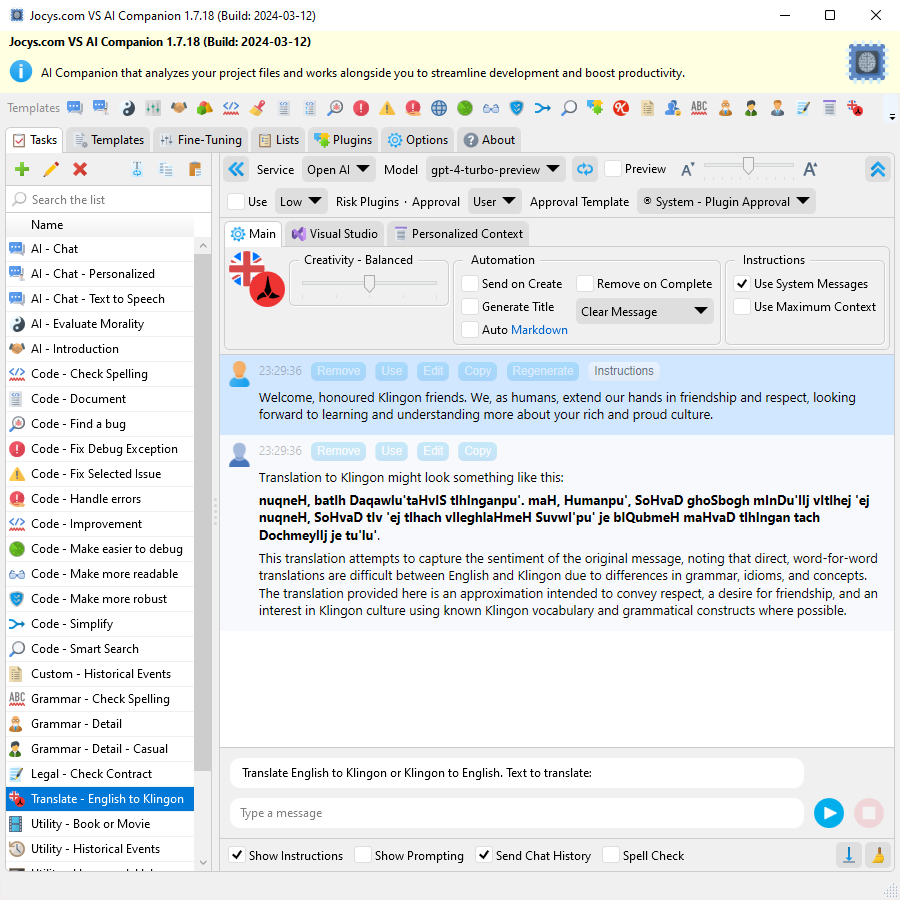

# Jocys.com VS AI Companion

The AI Companion is a tool that analyzes your project files and works alongside you or your team to streamline development and boost productivity. It can be installed as a Visual Studio extension or run as a standalone application.

This is a free and open-source project for people who have a paid OpenAI API account. More information can be found at https://platform.openai.com/.

# Download

Digitally Signed Standalone/Portable Application v1.0.18 (2023-06-18)

[Download - JocysCom.VS.AiCompanion.App.zip](https://github.com/JocysCom/VsAiCompanion/releases/download/1.1.0.0/JocysCom.VS.AiCompanion.App.zip)

You can download latest version Visual Studio Extension from <a href="https://marketplace.visualstudio.com/items?itemName=JocysCom.JocysComVsAiCompanion">VS AI Companion - Visual Studio Marketplace</a> or install by using Visual Studio Extension Manager.

# System Requirements

- Microsoft .NET 6.0
  https://dotnet.microsoft.com/download/dotnet

## Why was this extension created?
I wanted something more advanced than GitHub CoPilot. I envisioned an application that could automate the most popular tasks using AI. My goal was for the AI to answer questions about an entire solution or to rewrite a whole Visual Studio Solution in a different language.

## Limitations
You can ask questions about an entire solution or project using the "Code - Smart Search" template. However, the size of the solution or project is limited by the maximum amount of tokens the AI can process. People who have access to the GPT-4 API can upload projects or solutions for AI analysis, up to sizes of 128-260KB. These limitations could potentially be removed if you choose to send data to an AI hosted on-premises.

## How it works

The application (or extension) allows you to create complex prompt templates and attach data from various sources such as the Clipboard, Selection, Active Document, Selected Documents, Active Project, Selected Project, Solution, Selected Error, or Chat History. Then, with just a single button press, you can run that template. The data will be sent to the AI model of your choice at https://api.openai.com.

## Where to get API Organization ID and API Key?

https://platform.openai.com/account/org-settings

## Screenshots

Code - Smart Search: The AI can provide you with the exact location of specific code features:

Application Options:

Task and template settings are saved in separate files for easy exchange and sharing:

Various Templates:

Template: Code - Document

Template: Custom - Historical Events

Template: Translate - English to Klingon:

