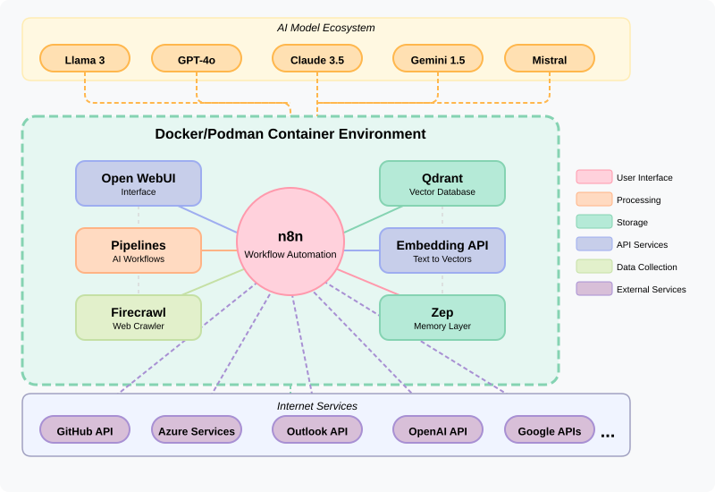
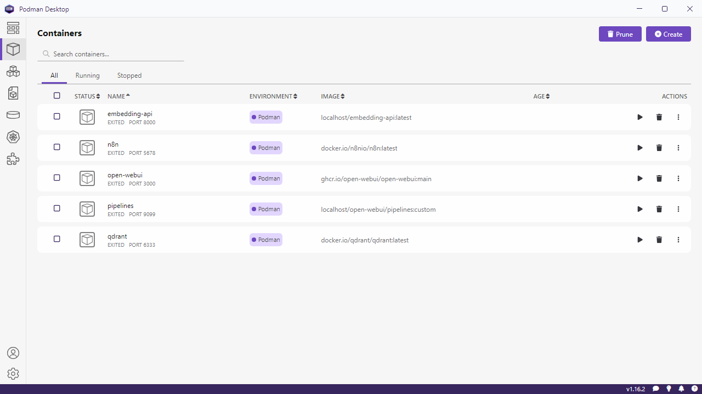
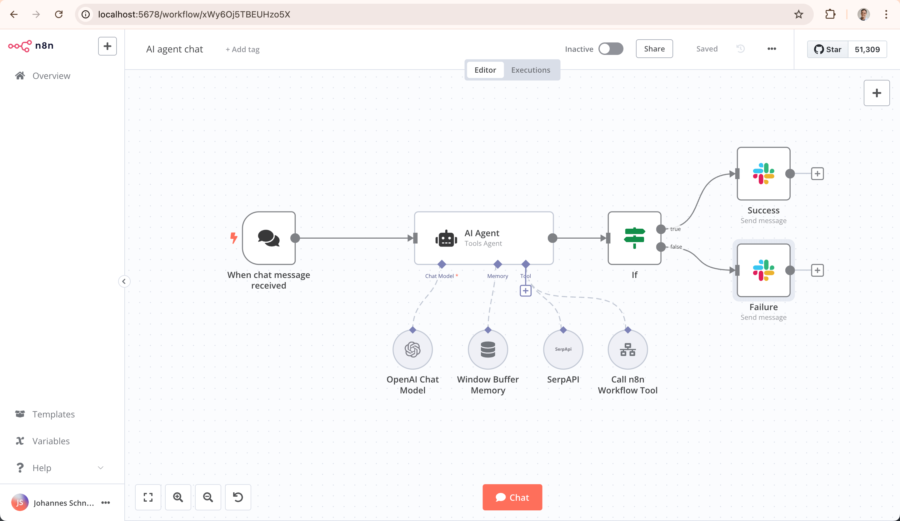

## Overview

This solution uses containerization to simplify the installation, integration, and management of several AI and automation tools on Windows. The provided PowerShell scripts work with Docker or Podman to deploy containerized applications that are easy to install, update, and maintain. These tools eliminate complex manual configurations and dependency issues by isolating each service in its own container, allowing focus on solving business problems instead of technical setup.

## Key Benefits & Goals

- [x] **Modular AI System:** Provides a modular architecture where each AI component is best-in-class.
- [x] **Versatile Deployment:** Supports all three environment types:
  - **Local:** For maximum privacy.
  - **Self-hosted:** For control and flexibility.
  - **Cloud:** For unlimited scaling.
- [x] **AI Agent Workspace:** Setup folder is designed as an AI Agent workspace. Open-source modules are frequently updated and often require customized setup processes. AI Agent helps to update setup scripts and configurations efficiently.
- [x] **Aspire Configuration:** Uses Aspire configuration files to make the setup more compatible with more platforms.

## Managerial Overview

This system is designed to reduce technical debt and accelerate AI adoption.

- **Cost Efficiency:** Utilizing open-source, best-in-class modules avoids vendor lock-in and high licensing fees associated with proprietary monolithic AI platforms.
- **Risk Mitigation:** Running locally or self-hosted ensures sensitive data remains within internal control, addressing compliance and privacy concerns.
- **Agility & Innovation:** Modular design allows swapping individual components as better alternatives emerge, ensuring the AI stack remains cutting-edge without requiring a complete system overhaul.
- **Operational Resilience:** Containerization ensures that issues in one service do not impact the entire system, and automated backup/restore scripts minimize downtime.
- **Scalability:** Start small with a local deployment for proof-of-concept and seamlessly scale to cloud infrastructure as demand grows.

## Containerized AI Tools Architecture

  

### Local Installation Structure

The following tree diagram illustrates how containers are installed and managed on a local Windows machine using WSL2 and Podman.

```text
Windows 11                        ← real, bare-metal host
│
├── NVIDIA GPU Driver (installed on Windows)
│   └── nvidia-smi.exe (C:\Windows\System32\)
│
└── WSL2 subsystem (type-2 hypervisor built into Windows)  ← virtualisation layer
    │
    ├── WSL2 default distro (e.g. Ubuntu) ← Required for WSL2 initialization
    │
    ├── WSL2 distro "OpenClaw-WSL" (Ubuntu) (imported via wsl --import)  ← dedicated, disposable
    │   │
    │   ├── Node.js ≥ 24
    │   ├── openclaw CLI + Gateway daemon (systemd user service)
    │   │   ├── listens on 127.0.0.1:18789 (Control UI / WebSocket)
    │   │   ├── listens on 127.0.0.1:18793 (Canvas host)
    │   │   └── config/state: ~/.openclaw/
    │   │
    │   ├── Agent sandbox (optional, Docker-in-WSL or Podman)
    │   │   └── throwaway containers for shell/file tool execution
    │   │
    │   └── Channel connections (outbound)
    │       ├── WhatsApp (Baileys / WhatsApp Web protocol)
    │       ├── Telegram (Bot API / grammY)
    │       ├── Discord (Bot API / discord.js)
    │       ├── Signal / iMessage / Slack / Teams / etc.
    │       └── WebChat (built-in, via Control UI)
    │
    ├── Podman Desktop (optional UI on Windows)  ← GUI for Podman
    │
    ├── Podman CLI (Windows `podman.exe`)        ← CLI used by scripts/terminal
    │
    └── WSL2 distro "podman-machine-default" (Fedora CoreOS image)  ← **Podman Host VM**
        │
        ├── NVIDIA Container Toolkit  ← Required for GPU acceleration
        │   ├── nvidia-ctk
        │   └── CDI specifications: /etc/cdi/nvidia.yaml, /var/run/cdi/nvidia.yaml
        │
        ├── login shell: bash         ← what you reach with `podman machine ssh`
        │
        └── podman (rootless) daemon  ← container engine running as that user
            │
            ├── container "n8n"       ← Linux container, --network host
            │   ├── /bin/sh (root)    ← started by `sudo podman exec -it --user root n8n /bin/sh`
            │   ├── node /usr/bin/n8n ← the real application
            │   └── host.local → 127.0.0.1 (reaches Windows host services via mirrored loopback)
            │
            └── container "qwen3-embedding-4b" ← Linux container, NOT a VM
                ├── /bin/sh (root)    ← started by `sudo podman exec -it --user root qwen3-embedding-4b /bin/sh`
                ├── ollama serve      ← the real application
                └── GPU access via: --device nvidia.com/gpu=all
```

### Network Architecture

WSL2 supports two networking modes that affect how containers communicate with external services. The scripts configure **mirrored networking** by default, which is required for corporate environments.

#### Mirrored Mode (Recommended — configured by `Setup_Core_1_WSL2.ps1`)

In mirrored mode, WSL2 shares the host's network interfaces directly. All outbound traffic from containers uses the **same external IP address** as the Windows host, and VPN/proxy settings are inherited automatically.

Containers that need to reach Windows host services (e.g., SQL Server) use `--network host` mode with `--add-host host.local:127.0.0.1`. This makes `host.local` resolve to `127.0.0.1`, which in host network mode reaches the Windows host via mirrored loopback — no firewall rules needed.

```text
┌─────────────────────────────────────────────────────────────────────┐
│ Windows Host (e.g., IP: 10.1.2.50 via VPN)                          │
│                                                                     │
│  %UserProfile%\.wslconfig:                                          │
│    [wsl2]                                                           │
│    networkingMode=mirrored    ← WSL2 shares host network interfaces │
│    dnsTunneling=true          ← DNS queries go through Windows      │
│    autoProxy=true             ← proxy settings inherited            │
│                                                                     │
│  SQL Server listening on localhost:1433                             │
│                                                                     │
│  ┌────────────────────────────────────────────────────────────────┐ │
│  │ WSL2 podman-machine-default (Fedora CoreOS)                    │ │
│  │ IP: same as host (10.1.2.50) ← mirrored!                       │ │
│  │                                                                │ │
│  │  ┌──────────────────────────┐  ┌──────────────────────────┐    │ │
│  │  │ n8n container            │  │ other containers         │    │ │
│  │  │ --network host           │  │ Podman bridge 10.88…     │    │ │
│  │  │ host.local → 127.0.0.1   │  └──────────────┬───────────┘    │ │
│  │  │   ↓ loopback → Windows   │                 │                │ │
│  │  └──────────┬───────────────┘                 │                │ │
│  │             │                                 │                │ │
│  │             └──────────┬──────────────────────┘                │ │
│  │                        │                                       │ │
│  └────────────────────────┼───────────────────────────────────────┘ │
│                           │                                         │
│                    Same IP: 10.1.2.50                               │
│                           │                                         │
└───────────────────────────┼─────────────────────────────────────────┘
                            │
                   Corporate Firewall ← recognises host IP → ALLOWED
                            │
                   Azure OpenAI / Internal Endpoints
```

#### NAT Mode (Default WSL2 — problematic for corporate networks)

Without mirrored networking, WSL2 creates a separate virtual network with its own IP. Outbound traffic may use a different external IP, causing corporate firewalls to block connections.

```text
┌─────────────────────────────────────────────────────────────────────┐
│ Windows Host (IP: 10.1.2.50 via VPN)                                │
│                                                                     │
│  ┌──────────────────────────────────────────────────────────────┐   │
│  │ vEthernet (WSL) — virtual switch: 172.28.0.1                 │   │
│  │                                                              │   │
│  │  ┌────────────────────────────────────────────────────────┐  │   │
│  │  │ WSL2 podman-machine-default: 172.28.x.y ← different!   │  │   │
│  │  │                                                        │  │   │
│  │  │  ┌─────────────┐  ┌─────────────┐                      │  │   │
│  │  │  │ n8n 10.88…  │  │ other 10.88…│                      │  │   │
│  │  │  └──────┬──────┘  └──────┬──────┘                      │  │   │
│  │  │         └────────┬───────┘                             │  │   │
│  │  └──────────────────┼─────────────────────────────────────┘  │   │
│  │                     │ NAT translation                        │   │
│  └─────────────────────┼────────────────────────────────────────┘   │
│                        │                                            │
│                 Different IP: 10.1.2.51 or other                    │
│                        │                                            │
└────────────────────────┼────────────────────────────────────────────┘
                         │
                Corporate Firewall ← unknown IP → BLOCKED
                         │
                Azure OpenAI / Internal Endpoints
```

#### Verifying Network Configuration

Use the external IP consistency test to verify all layers share the same IP:

```powershell
# From any setup script's helper context:
Test-NetworkIPConsistency -ContainerName "n8n"

# Example output (mirrored mode — all IPs match):
#   Windows host   : 203.0.113.42
#   Podman VM      : 203.0.113.42
#   Container 'n8n': 203.0.113.42
#   RESULT: All tested layers share the same external IP address.
```

To configure mirrored networking:

```powershell
# Option 1: Run the WSL2 setup script and choose option 3
.\Setup_Core_1_WSL2.ps1

# Option 2: The Podman machine init (Setup_Core_1b_Podman.ps1) offers to configure it automatically

# After configuration, restart WSL and Podman:
.\Setup_Util_RestartPodmanAndWSL.ps1 -FullShutdown -VerifyNetwork
```

## Auto-Start Mechanisms

This project uses two different approaches to ensure services start automatically when Windows boots. The approach depends on whether the service runs inside a Podman-managed container or directly inside a WSL2 distro.

### Approach 1: Windows Service (`sc.exe`) — Podman

| Item | Value |
|---|---|
| **Service Name** | `PodmanMachineStart` |
| **Used By** | Podman machine (`Setup_Core_1b_Podman.ps1`) |
| **Runs As** | `SYSTEM` account (pre-login, no user session required) |
| **Mechanism** | `sc.exe create` registers a native Windows service that executes a batch file to start the Podman machine at boot |
| **Requires Admin** | Yes (to create/delete the service) |

**Why SYSTEM works for Podman:** Podman has its own machine-management layer (`podman machine start`) that does not depend on a per-user WSL distro registration. The SYSTEM account can invoke `podman machine start` directly.

**Manual removal:**

```powershell
sc.exe stop PodmanMachineStart
sc.exe delete PodmanMachineStart
```

### Approach 2: Scheduled Task — n8n, Qdrant, OpenClaw

| Item | Value |
|---|---|
| **Task Names** | `VsAiCompanion-n8n`, `VsAiCompanion-Qdrant`, `OpenClaw-WSL-Boot` |
| **Used By** | n8n (`Setup_App_3_n8n_Core_Windows.ps1`), Qdrant (`Setup_App_5a_Qdrant_Core_Windows.ps1`), OpenClaw (`Setup_App_OpenClaw.ps1`) |
| **Runs As** | Current user account |
| **Mechanism** | `Register-ScheduledTask` creates a task that launches a PowerShell wrapper script |
| **Requires Admin** | Depends on sub-mode (see below) |

These services run inside WSL2 distros, which are registered per-user (`HKCU`). The SYSTEM account cannot see user-registered distros, so the task must run as the current user. Two sub-modes are available:

| Sub-Mode | Trigger | Logon Type | Admin Required | Starts |
|---|---|---|---|---|
| **Pre-login** | `AtStartup` | S4U (Service-for-User) | Yes (auto-elevated via UAC) | Before any user logs in |
| **Post-login** | `AtLogOn` | Interactive | No | When the user logs in |

The shared function `Install-ScheduledTaskService` (in `Setup_Helper_CoreFunctions.ps1`) handles elevation automatically. When pre-login mode is selected and the script is not already elevated, it launches a UAC prompt to register the task in an elevated child process. The user only needs to approve the UAC dialog; no manual "Run as Administrator" is required.

**Manual removal:**

```powershell
# List the tasks
Get-ScheduledTask -TaskName "VsAiCompanion-*", "OpenClaw-*" | Format-Table TaskName, State

# Remove a specific task
Unregister-ScheduledTask -TaskName "VsAiCompanion-n8n" -Confirm:$false
Unregister-ScheduledTask -TaskName "VsAiCompanion-Qdrant" -Confirm:$false
Unregister-ScheduledTask -TaskName "OpenClaw-WSL-Boot" -Confirm:$false
```

### Viewing Auto-Start Items

| Tool | What It Shows | How to Open |
|---|---|---|
| **Task Scheduler** | Scheduled Tasks (Approach 2) | Run `taskschd.msc` — look under the root `\` folder for task names listed above |
| **Services** | Windows Services (Approach 1) | Run `services.msc` — search for `PodmanMachineStart` |
| **Sysinternals Autoruns** | Both approaches in a unified view | Download from [Autoruns](https://learn.microsoft.com/en-us/sysinternals/downloads/autoruns) — check the **Services** tab for Podman and the **Scheduled Tasks** tab for n8n/Qdrant/OpenClaw |

> **Tip:** [Sysinternals Autoruns](https://learn.microsoft.com/en-us/sysinternals/downloads/autoruns) is the recommended tool for a complete overview of all auto-start entries on a Windows system. It shows services, scheduled tasks, startup programs, and more in a single interface.

## Available Services

All services are containerized and can be managed through the provided PowerShell scripts. Each service runs on a specific TCP port and uses a Docker image for deployment.

### Container Management

- **TCP 9000** - `portainer/portainer-ce:latest` - Lightweight container management UI with visual dashboard
- **TCP 9443** - `portainer/portainer-ce:latest` - Portainer HTTPS interface for secure container management

### AI and Automation

- **TCP 9099** - `ghcr.io/open-webui/pipelines:main` - AI workflow orchestration and pipeline management
- **TCP 3000** - `ghcr.io/open-webui/open-webui:main` - AI model management interface with chat capabilities
- **TCP 5678** - `docker.io/n8nio/n8n:latest` - Visual workflow automation platform for integrating services
- **TCP 5433** - `pgvector/pgvector:pg16` - PostgreSQL database with pgvector for Zep memory
- **TCP 7474, 7687** - `neo4j:5.22.0` - Neo4j graph database for Zep Graphiti
- **TCP 8003** - `zepai/graphiti:0.3` - Graphiti Knowledge Graph API for Zep
- **TCP 8004** - `zepai/zep:latest` - Zep Legacy temporal knowledge graph-based memory layer for AI agents

### Web Scraping and Data Processing

- **TCP 6379** - `redis:alpine` - Redis cache server for Firecrawl data storage and queuing
- **TCP 3002** - `ghcr.io/firecrawl/firecrawl` - Web crawling API service for automated data extraction
- **TCP 3010** - `mcr.microsoft.com/playwright:latest` - Web rendering service for dynamic content scraping
- **(Worker)** - `ghcr.io/firecrawl/firecrawl` - Background worker for processing crawling jobs
- **(Internal)** - `postgres:16-alpine` - Dedicated PostgreSQL database for Firecrawl (internal network only)

### Vector Database and Embeddings

- **TCP 6333** - `qdrant/qdrant` - Vector database HTTP API for semantic search and similarity matching
- **TCP 6334** - `qdrant/qdrant` - Vector database gRPC interface for high-performance operations
- **TCP 8000** - `qdrant-mcp-server` - Qdrant Model Context Protocol (MCP) Server
- **TCP 8001** - `ollama/ollama:latest` - Qwen3 Embedding 4B model running via Ollama

### Database Management

- **TCP 8978** - `dbeaver/cloudbeaver:latest` - Web-based database administration interface

## Tools Provided

- **Docker / Podman Setup**  
    These scripts automatically install and configure the underlying container engine. Docker and Podman allow running applications in isolated environments, ensuring that software dependencies and configurations don't conflict with the host system. They make deploying, updating, and troubleshooting services quick and consistent. This setup forms the backbone of the containerized solution, ensuring a smooth installation experience.

  - Dockerfile: A blueprint for building a Docker image. It contains instructions (code) to assemble the image layer by layer, which will ultimately run your application within a container.
  - Image: An immutable template created from a Dockerfile. It's a snapshot containing all the necessary code, libraries, dependencies, and configuration needed to run an application. Images ensure containers built from them are consistent across different systems.
  - Container: A runnable instance of an image. It's essentially a running process that executes the application packaged within the image. Multiple containers can be run from the same image.
  - Volume: The recommended mechanism for persisting data generated and used by Docker containers. Volumes are managed by Docker/Podman and exist separately from the container's lifecycle. This means data stored in a volume remains even if the container is stopped, deleted, or recreated. **Volumes are specifically designed to store application data (like databases, user uploads, configuration files) and require backing up to preserve user data and application state separately from the container itself.**

    

- **Portainer**
    Portainer is a lightweight management UI that allows easy management of Docker and Podman environments. It provides a simple, intuitive interface for creating, managing, and monitoring containers, volumes, networks, and images. Portainer simplifies container management by offering a visual dashboard to view container status, logs, and resource usage at a glance, making it perfect for both beginners and experienced users.
    

- **Open WebUI**
    Open WebUI delivers a friendly graphical interface for managing AI pipelines and container operations. It hides the underlying command-line complexity and provides real-time monitoring, status updates, and control options at the click of a button. This tool enables easy tracking of system health, log viewing, and service management, making it ideal for users who prefer a visual approach.
    

- **Pipelines for WebUI**
    The Pipelines Container is designed to streamline and orchestrate AI workflows. It encapsulates all necessary components to execute complex data processing, inference, and transformation tasks without requiring manual setup of multiple services. By providing an easy-to-backup and restore container, it ensures continuity and reliability in running AI pipelines. This tool saves time and reduces errors by automating the entire pipeline process.

- **n8n Workflow Automation**
    n8n is a powerful workflow automation platform that connects multiple applications and automates tasks without writing code. It offers a visual interface to design, execute, and monitor complex workflows that integrate data between various services, solving common integration challenges. This tool is perfect for automating repetitive tasks, reducing manual errors, and saving time on business processes.
    

- **Firecrawl Crawler**  
    Firecrawl is a dedicated web crawling tool that automates the extraction and organization of data from websites. It addresses the challenge of manually gathering web data by efficiently scraping and processing large volumes of information. Integrated with a dedicated Redis caching mechanism, Firecrawl enhances performance and reliability while minimizing system load. This makes it ideal for tasks like market research, content analysis, and data collection.

- **Qdrant Vector Database**  
    Qdrant is a specialized vector database for managing high-dimensional data, which is essential for semantic search and machine learning applications. It stores and retrieves numeric representations of data (embeddings) quickly, enabling efficient similarity searches and recommendation engines. This tool helps solve challenges related to processing complex data comparisons with ease and reliability. Its containerized setup makes it accessible even for those new to machine learning infrastructure.
- **Embedding API (Ollama)**
    The Embedding API uses Ollama to run the Qwen3-Embedding-4B model, converting raw text into semantically meaningful numeric vectors (embeddings). It simplifies complex tasks like document similarity, clustering, and recommendation by providing a reliable, scalable API endpoint. This tool enables harnessing the power of deep learning models efficiently.

## Folder Structure & Script Descriptions

The PowerShell scripts are organized as follows, following the naming pattern: `Setup_{Category}[_{InstallOrder}]_{Primary}[_{Dependency}].ps1`

### Shared Helper Functions (`Setup_Helper_*.ps1`)

These scripts contain reusable functions imported by other setup scripts. They are not meant to be run directly.

- **Setup_Helper_BackupRestore.ps1**: Functions for backing up and restoring container images and volumes (using `tar`).
- **Setup_Helper_ContainerEngine.ps1**: Functions for selecting the container engine (Docker/Podman) and finding its path.
- **Setup_Helper_ContainerManagement.ps1**: Functions for common container management tasks (e.g., updating, removing).
- **Setup_Helper_CoreFunctions.ps1**: Core helper functions (e.g., ensuring elevation, setting script location, menu loop).
- **Setup_Helper_NetworkTests.ps1**: Functions for testing network port connectivity (TCP, HTTP, WebSocket).
- **Setup_Helper_WSLFunctions.ps1**: Functions related to checking WSL status.

### Core System & Container Engine Setup (`Setup_Core_*.ps1`)

These scripts handle the initial setup of the container environment and core management tools.

- **Setup_Core_1_WSL2.ps1**: Ensures Windows Subsystem for Linux (WSL2) is installed and configured, which is often required for Docker/Podman on Windows.
- **Setup_Core_1a_Docker.ps1**: Installs and configures Docker Desktop or Docker Engine on Windows.
- **Setup_Core_1b_Podman.ps1**: Installs and configures Podman, including the CLI, machine, service, and optionally Podman Desktop.
- **Setup_Core_1c_ImageVolumeBackupRestore.ps1**: Provides a menu-driven interface for backing up or restoring container images and volumes using functions from `Setup_Helper_BackupRestore.ps1`.
- **Setup_Core_1d_Portainer.ps1**: Installs and configures the Portainer container management UI (supports Docker/Podman).

### Application Suites - Deployment & Management (`Setup_App_*.ps1`)

These scripts handle the deployment and management of specific containerized applications and their components.

- **Setup_App_2a_OpenWebUI_Pipelines.ps1**: Deploys the Pipelines container for AI workflow orchestration (supports Docker/Podman).
- **Setup_App_2b_OpenWebUI_UI.ps1**: Installs the Open WebUI container for managing AI models and interfaces (supports Docker/Podman).
- **Setup_App_3_n8n_Core.ps1**: Installs the n8n container for workflow automation (supports Docker/Podman).
- **Setup_App_3_n8n_Core_Windows.ps1**: Installs n8n natively on Windows (no container) with Scheduled Task auto-start service.
- **Setup_App_4a_Firecrawl_Postgres.ps1**: Installs the dedicated PostgreSQL container for Firecrawl.
- **Setup_App_4a_Firecrawl_Redis.ps1**: Installs the dedicated Redis container for Firecrawl data storage and queuing (supports Docker/Podman).
- **Setup_App_4b_Firecrawl_Worker.ps1**: Installs the Firecrawl Worker container for background processing (requires Redis, Postgres, and Playwright).
- **Setup_App_4c_Firecrawl_API.ps1**: Installs the Firecrawl API container for web crawling (requires Redis, Postgres, and Playwright).
- **Setup_App_5a_Qdrant_Core.ps1**: Installs the Qdrant vector database container (supports Docker/Podman).
- **Setup_App_5a_Qdrant_Core_Windows.ps1**: Installs Qdrant natively on Windows (no container) with Scheduled Task auto-start service.
- **Setup_App_5b_Qdrant_MCPServer.ps1**: Builds and runs the Qdrant MCP Server container from source (supports Docker/Podman).
- **Setup_App_6_Qwen3_Embedding_4B.ps1**: Installs Ollama with the Qwen3-Embedding-4B model (supports Docker/Podman).
- **Setup_App_8_CloudBeaver_Core.ps1**: Installs the CloudBeaver container for web-based database administration (supports Docker/Podman).
- **Setup_App_9_Playwright_Service.ps1**: Installs the Playwright Service container for web rendering (supports Docker/Podman).
- **Setup_App_OpenClaw.ps1**: Installs OpenClaw multi-channel AI gateway in a dedicated WSL2 distro with Scheduled Task auto-start service.
- **Setup_App_Zep_1_PostgreSQL.ps1**: Installs PostgreSQL with pgvector for Zep.
- **Setup_App_Zep_2_Neo4j.ps1**: Installs Neo4j for Zep Graphiti.
- **Setup_App_Zep_3_Graphiti.ps1**: Installs the Graphiti service for Zep.
- **Setup_App_Zep_4_Legacy.ps1**: Installs the Zep Legacy container (requires PostgreSQL, Neo4j, and Graphiti).

### Data Management (`Setup_Data_*.ps1`)

These scripts handle application-specific data export, import, and backup operations.

- **Setup_Data_3_n8n_ExportImport.ps1**: Exports and imports n8n workflows and credentials (requires n8n container).
- **Setup_Data_5_Qdrant_ExportImport.ps1**: Exports and imports Qdrant data.
- **Setup_Data_9_SQL_BackupPapers.ps1**: Backs up SQL data related to papers.

### Utilities & Testing (`Setup_Util_*.ps1`)

These scripts provide utility functions or testing capabilities for specific applications.

- **Setup_Util_6_Embedding_Test.ps1**: Tests the functionality of the deployed Embedding API.


