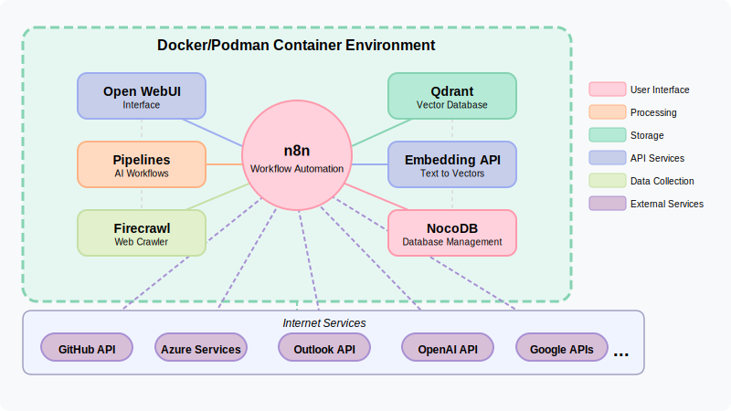
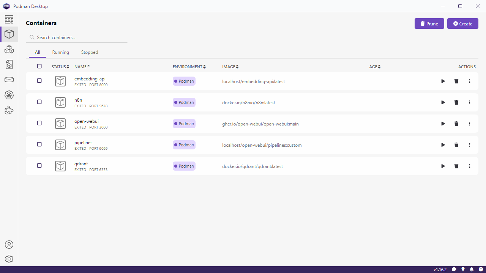
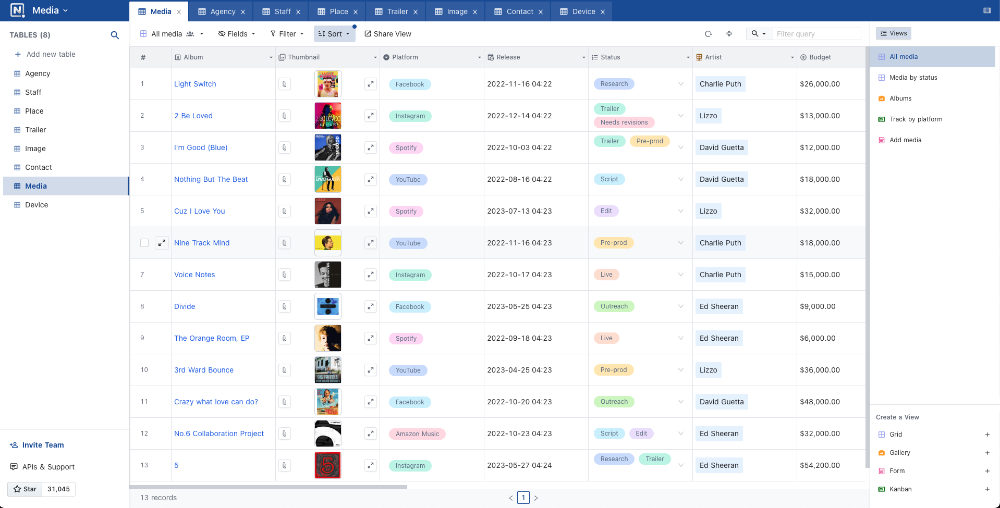

## Overview

This solution uses containerization to simplify the installation, integration, and management of several AI and automation tools on Windows. The provided PowerShell scripts work with Docker or Podman to deploy containerized applications that are easy to install, update, and maintain. These tools eliminate complex manual configurations and dependency issues by isolating each service in its own container, allowing you to focus on solving business problems instead of technical setup.

## Containerized AI Tools Architecture

  

## Tools Provided

- **Docker / Podman Setup**  
  These scripts automatically install and configure the underlying container engine on your system. Docker and Podman allow you to run applications in isolated environments, ensuring that software dependencies and configurations don't conflict with your host system. They make deploying, updating, and troubleshooting services quick and consistent. This setup forms the backbone of the containerized solution, ensuring a smooth installation experience.
  

- **Portainer**  
  Portainer is a lightweight management UI that allows you to easily manage your Docker and Podman environments. It provides a simple, intuitive interface for creating, managing, and monitoring containers, volumes, networks, and images. Portainer simplifies container management by offering a visual dashboard where you can view container status, logs, and resource usage at a glance, making it perfect for both beginners and experienced users.
  

- **Open WebUI**  
  Open WebUI delivers a friendly graphical interface for managing your AI pipelines and container operations. It hides the underlying command-line complexity and provides real-time monitoring, status updates, and control options at the click of a button. This tool enables you to easily track system health, view logs, and manage services, making it ideal for users who prefer a visual approach.  
  

- **Pipelines for WebUI**  
  The Pipelines Container is designed to streamline and orchestrate your AI workflows. It encapsulates all necessary components to execute complex data processing, inference, and transformation tasks without requiring manual setup of multiple services. By providing an easy-to-backup and restore container, it ensures continuity and reliability in running your AI pipelines. This tool saves time and reduces errors by automating the entire pipeline process.

- **n8n Workflow Automation**  
  n8n is a powerful workflow automation platform that lets you connect multiple applications and automate tasks without writing code. It offers a visual interface to design, execute, and monitor complex workflows that integrate data between various services, solving common integration challenges. This tool is perfect for automating repetitive tasks, reducing manual errors, and saving time on business processes.  
  

- **Firecrawl Crawler**  
  Firecrawl is a dedicated web crawling tool that automates the extraction and organization of data from websites. It addresses the challenge of manually gathering web data by efficiently scraping and processing large volumes of information. Integrated with a dedicated Redis caching mechanism, Firecrawl enhances performance and reliability while minimizing system load. This makes it ideal for tasks like market research, content analysis, and data collection.

- **Qdrant Vector Database**  
  Qdrant is a specialized vector database for managing high-dimensional data, which is essential for semantic search and machine learning applications. It stores and retrieves numeric representations of data (embeddings) quickly, enabling efficient similarity searches and recommendation engines. This tool helps solve challenges related to processing complex data comparisons with ease and reliability. Its containerized setup makes it accessible even for those new to machine learning infrastructure.  
  
- **Embedding API**  
  The Embedding API converts raw text into semantically meaningful numeric vectors (embeddings) through advanced natural language processing models. It simplifies complex tasks like document similarity, clustering, and recommendation by providing a reliable, scalable API endpoint. This tool lets you harness the power of deep learning models without needing to manage heavy compute resources locally. As a result, developers can efficiently integrate natural language understanding into their applications.

- **NocoDB**  
  NocoDB transforms any spreadsheet into a smart relational database accessible via a modern web interface. It makes data management intuitive and collaborative, enabling users without technical expertise to create applications, manage records, and generate reports effortlessly. With features similar to Airtable, NocoDB helps teams manage their data visually and efficiently, reducing the need for complex coding or database management skills.  
  

## Folder Structure & Script Descriptions

The PowerShell scripts are organized as follows:

**Shared Helper Functions (`Setup_0_*.ps1`)**
These scripts contain reusable functions imported by other setup scripts. They are not meant to be run directly.
- **Setup_0_BackupRestore.ps1**: Functions for backing up and restoring container images and state.
- **Setup_0_ContainerEngine.ps1**: Functions for selecting the container engine (Docker/Podman) and finding its path.
- **Setup_0_ContainerMgmt.ps1**: Functions for common container management tasks (e.g., updating, removing).
- **Setup_0_Core.ps1**: Core helper functions (e.g., ensuring elevation, setting script location, menu loop).
- **Setup_0_Network.ps1**: Functions for testing network port connectivity (TCP, HTTP, WebSocket).
- **Setup_0_WSL.ps1**: Functions related to checking WSL status.

**Core Setup & Management (`Setup_1_*.ps1`)**
These scripts handle the initial setup of the container environment and core management tools.
- **Setup_1_WSL2.ps1**: Ensures Windows Subsystem for Linux (WSL2) is installed and configured, which is often required for Docker/Podman on Windows.
- **Setup_1a_Docker.ps1**: Installs and configures Docker Desktop on Windows.
- **Setup_1a_Podman.ps1**: Installs and configures Podman, including the CLI and optionally Podman Desktop.
- **Setup_1a_Podman_ExportContainers.ps1**: Script specifically for exporting existing Podman containers (likely for backup purposes).
- **Setup_1a_Podman_Restore.ps1**: Script specifically for restoring Podman containers from backups.
- **Setup_1b_BackupRestore.ps1**: Provides a menu-driven interface for backing up or restoring container images using functions from `Setup_0_BackupRestore.ps1`.
- **Setup_1c_Portainer.ps1**: Installs and configures the Portainer container management UI.

**Application Deployment (`Setup_2-7_*.ps1`)**
These scripts handle the deployment and management of specific containerized applications.
- **Setup_2a_Pipelines.ps1**: Deploys the Pipelines container for AI workflow orchestration.
- **Setup_2b_OpenWebUI.ps1**: Installs the Open WebUI container for managing AI models and interfaces.
- **Setup_3_n8n.ps1**: Installs the n8n container for workflow automation.
- **Setup_4_Firecrawl.ps1**: Installs the Firecrawl container (and its Redis dependency) for web crawling.
- **Setup_5_Qdrant.ps1**: Installs the Qdrant vector database container.
- **Setup_6_Embedding.ps1**: Builds and runs the custom Embedding API container.
- **Setup_6_Embedding_Test.ps1**: Tests the functionality of the deployed Embedding API.
- **Setup_7_NocoDB.ps1**: Installs the NocoDB container for no-code database management.
